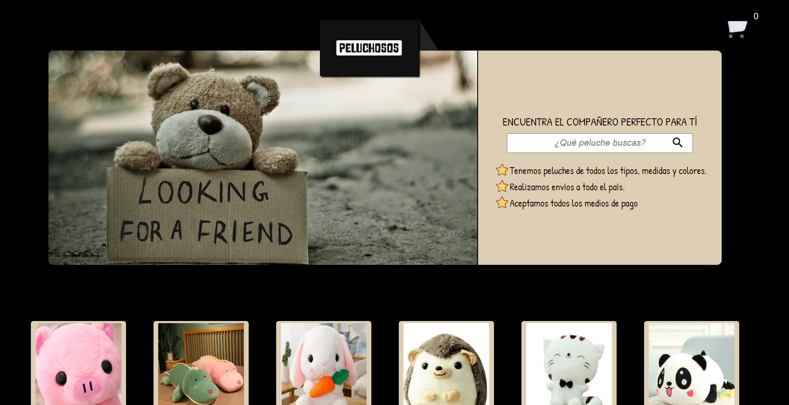

## <h1 align="center">🧸 Peluchosos</h1> 

Estudiando Javascript Avanzado con Juan Pablo De la torre Valdez - Código con Juan
 

Es un carrito de compras de un comercio de peluches, con filtro de búsqueda y Local Storage incluído

## 💟 Preview
  

   
   
  

## 💻 Tecnologías Utilizadas 

## 🌼 URL 

Para interactuar con la plataforma web por favor accede a: <a href="https://lilitaschini.github.io/Peluchosos/" target="_blank">Peluchosos</a>

## 🛠 Cómo usar
Cuando se ingresa a la página se pueden visualizar los productos, con sus precios y cantidad. Es posible filtrar por nombre los productos que se desean adquirir.

También cuenta con la funcionalidad de agregar al carrito, eliminar, vaciar el carrito y confirmar compra.

Cuenta con Local Storage por lo que si el cliente se retira de la página y vuelve a ingresar más tarde, se habrán guardado en su caché los productos que ya había elegido antes, facilitando la experiencia de usuario,
comodidad, y teniendo una mayor rentabilidad en cuanto a los productos.  

## ⚙ Recursos
Aprovecho para proveer el curso de
<a href="https://www.udemy.com/course/javascript-moderno-guia-definitiva-construye-10-proyectos/" target="_blank">JS Moderno - Código con Juan</a>
el cual es muy agradable si estas empezando con una pequeña base, o incluso si quieres enfocarte en practicar mucho. Es un curso muy completo que cuenta con 10 proyectos y se organiza en contenidos desde maquetación 
básica y avanzada hasta uso de Frameworks, backend con NodeJS, base de datos, etc. Finaliza con un proyecto MERN.

## Estado del Proyecto
 Completo. 
